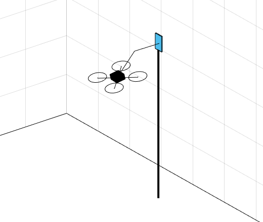

# Aerial manipulator with a fixed end-effector position: MATLAB simulation
## Overview
<p align="center">
  
This repository contains the MATLAB simulation for aerial manipuator with a fixed end-effector position (i.e., plug-pulling aerial manipulator) presented in [1]. The aerial manipulator which is configured with a quad-rotor and a 2-DOF robotic manipulator with a gripper try to pull the plug out of the socket by tilting its body. The results of the simulation can be visualized with various plots and a simple 3D animation video.

## How to run
### Installation
1. Clone this repository into your MATLAB workspace.  
```sh
git clone github.com/JH-Byun/aerial_manipulator_with_a_fixed_end-effector_position-matlab.git
```

### Execution
1. Double click on main.m file.
2. If you want to watch the resultant video, please set the parameter named **animation_view** to true.
3. Execute the simulation by press "F5" button.
  
## Detailed Descriptions for each file
**1. main.m**: The main file of a simulation about an aerial manipulator with a fixed end-effector position. It follows the control strategy introduced in [1].
  
**2. parameters.m**: Parameters utilized for constructing dynamics of the aerial manipulator.
  
**3. utils**
  <ol>
    
  **1) Rx.m**: Rotation matrix with respect to x-axis.
    
  **2) Ry.m**: Rotation matrix with respect to the y-axis.
    
  **3) Rz.m**: Rotation matrix with respect to z-axis.
    
  **4) hat.m**: The function making a se(3) matrix. 
    
  **5) invhat.m**: Inverse process of the hat.m function.
    
  **6) getQ.m**: Calculates a Q matrix from the Euler angles.
    
  **7) getQdot.m**: Calculates a Qdot matrix from the Euler rates.
    
  **8) constraint.m**: Saturates the input value with the given minimum and maximum values.
    
  </ol>
  
**4. dynamics**
  <ol>
    
  **1) FF_dynamics_gen.m**: By computing symbolic operations, it obtains the symbolic matrices of M, C, G, J_tau, A, and Adot which configure the Euler-Lagrange equation of the aerial manipulator system. Successively, it can also produce the following MATLAB functions which will be treated afterward.
    
  **2) getM.m**: Calculates the M matrix from state values and parameters.
    
  **3) getC.m**: Calculates the C matrix from state values, their time-derivative values, and parameters.
    
  **4) getG.m**: Calculates the G matrix from state values and parameters.
    
  **5) getJ_tau.m**: Calculates the J_tau matrix from state values and parameters.
    
  **6) getA.m**: Calculates the A matrix from state values and parameters.
    
  **7) getAdot.m**: Calculates the Adot matrix from state values, their time-derivative values, and parameters.
    
  **8) dynamics.m**: From the previous state values and control inputs (Total thrust and body torque), it calculates the next step's state values using ode45.m function of MATLAB.
 
  **9) robotic_manipulator_control.m**: In the actual experiment, the Dynamixel servo motor which is controlled by desired position angles will be utilized. This function makes the robotic manipulator's servo motors satisfactorily follow the desired angles.
  </ol>
  
**5. controller**
  <ol>
    
  **1) mixer.m**: convert the force and torque generated by each motor to the total thrust and the body moments.
    
  </ol>

### Reference
[1] Byun, Jeonghyun, and H. Jin Kim. "Robust Control of the Aerial Manipulator with a Fixed End-effector Position." 2021 21st International Conference on Control, Automation and Systems (ICCAS). IEEE, 2021.
